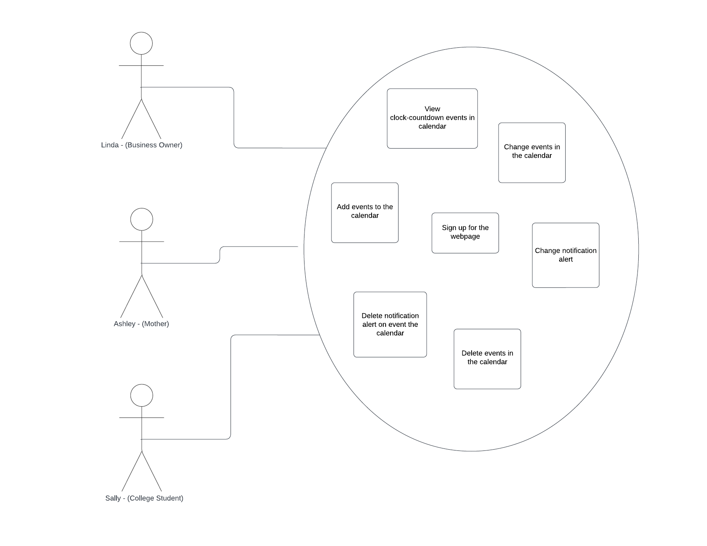

# Little-Bits
Team members include Dahga Muhumed, Nadin Qaqos and Robyn Smith.

### Computer CountDown Applicator

## Description
The calendar will show the countdown by each event as the user scrolls through the calendar.
The user can choose time frame on notifications example 1 week out or 3 hours out ect.

## Stackholders and their Interests
Interests are equal with the CountDown Applicator. Businesses and the public alike, eveyone has access to & can use the website as they choose.

### The Software Developer and Maintainer
- Easy to deploy and make changes as needed
- Supports different differnt platforms (i.e Android and IOS devices)
- Little operating costs 

### Public 
- The website is open to the public and is aimed for anyone to use and access. Free of charge and easy to use and manage. 

### Students 
- Easy access
- Free of charge
- Easy to used to help stay organized for multiple classes & activities 
### Small Businesses 
- Free, saves money in the long run
- Great tool to use for time management
- Accurate & well detailed layout
- Fast and easy to use with little to no training 

### Parent
- Fast and easy to use with little to no training 
- Easy to understand  
- Easy to keep track & organized
- 

## Personas 

### Sally - College Student  - written by Nadin
Sally is a college student who is knowledgeable about technology as she uses it a lot in her classes. It is important to her to be able to keep up with all of her assignments since she is taking so many classes this semester. She wants to be able to hand them in on time. 

### Ashley - Mother - written by Dahga
Ashley is a full time mom with 3 children all of which are in school and are involved in multiple extracurriculars. Ashley needs help keeping track of all the different events, appointments and activities that occur in her everyday schedule. Because she has all of her kids in multiple activities, its hard for her to keep track of the different schedules per child as well as her own. She wants to make sure she is on time for everything and is able to make time for herself but she needs something to help her keep track of everything and be punctual. Ashley is very organized and detailed oriented and relies on a written schedule to get through her everyday schedule. Ashley is also tech savvy and relies on her phone for a lot of things including email, calls, texts, social media and web browsing. 

### Linda – Business Owner - written by Robyn
Linda is 35 years old and lives in a small town in MN. She and her husband just started their own brewery. While her husband oversees making the beer and finding the right ingredients, she oversees everything else. Linda is comfortable with schedules and puts everything in her calendar on her cell phone as things come up. When Linda is at the computer, she uses the website to see how much time she has between tasks. Although she is not computer savvy, she uses what is most convenient to her. Linda is in charge of creating community events to bring people together at the brewery and ensuring all the servers are scheduled as needed. She is also in charge of the local bands that are able to play at the brewery at least once a week. She wants everyone to be happy and to establish a good relation in the community.

## User Stories 

### User Story #1 (Sally, College student) - Nadin
 Sally wants to keep track of her assignments and wants to keep up with all of the due dates. She wants to hand things in on time so that she doesn’t get stressed out with everything. She found this software that will help her do that and she intends to use it. Since she is very well versed in technology, she goes to her laptop and opens the website that uses this software. She creates an account by inputting all of the necessary information, then she begins to see where she could start. She sees a calendar and there is a + sign up at the top right corner. She clicks on that and proceeds to fill in the information for her assignment. She inputs the class name, the assignment name, and the due date. She also color coded her assignments by class. Once everything is filled in she presses enter and it shows up on the calendar. It shows up on the date it is due and how much time she has left to do it. She can also look at her assignment in chronological order to see what is the closest thing that is due. The software helped her to do all of these and she was able to keep up with which assignment was due when and how long she would have to do it before the due date.  

### User Story #2 (Sally, College student) - Nadin 
Sally has recently joined the computer science club, ACM, and would like to help keep track of all the events going on. She has the list of events that the club has planned and she enters the information into this countdown software she has signed up for. For every event she enters in the event name, date, and time of the event. Countdown clocks start to show up under the events once she clicks on “enter event”. One of the events is a really important event for the club. They are hosting an event for the entire school and she would like to prepare for it a week in advance. She clicks on the event she has written down and clicks on the notification button option. She scrolls to find “1 week reminder” and clicks on that. She saves the changes she has made to the event. A week before the event she gets a reminder of the event and she starts to prepare for it. She does a very good job preparing for this special event because she had enough time to get everything ready for it. The event ends in flying colors and the countdown app has helped her to accomplish this.

### User Story #3 (Ashley, Mother) - Dahga
It the start of a new week and Ashley is preparing for a hectic week to start. Brian, her oldest child, has 2 doctor appointments and soccer practice everyday after school from 3:30pm - 6:00pm. Lisa, her middle child, has a ballet recital Thurday at 7:00pm. And her youngest has a basketball practice after school as well as a big basketball game Wednesday night at 5:30pm. On top of that, Ashley has an eye appointment Tuesday at 2:30pm that she can't miss or it'll be her third time this year. Ashley needs to organize and manage her time carefully this week so she doesn't forget or make any mistakes. So she makes sure to open up & input all the scheduled appointments, activities, and games Sunday night so she doesn't forget the next morning before she begins her week. When the time starts to approach before the first activity, she has scheduled an alarm to notify her an hour before the first event so that she can get everything ready and done. Now, if she has anything else scheduled after the first event, she can schedule an alarm between 5 minutes to 12 hours before so she doesn't miss anything scheduled. 

### User Story #4 (Ashley, Mother) - Dahga 
Ashley and her family are going on a big family vacation this summer and wants everything to be perfect. She needs to plan the activities, book the hotel, rent a vehicle, print the plane tickets, pack her bags, etc. The whole family is coming which includes herself, her 3 children, and her spouse. The trip is just a few months away and she is already planning on the best dates to go and what time the activies will begin. Once she purchased the plane tickets, she decides she needs to set a countdown so that she doesn't accidently forget what day or time they leave for their vacation. She starts her countdown 2 months from the designated day as well as a countdown for when her and her family will wake up, makes sure they have everything packed and at the airport 2 hours before the flight takes off. She sets a countdown timer for each event they'll take part in, when they'll need to arrive and leave the hotel as well as when they need to get back to the airport so they can make it home. Ashley makes sure to schedule each countdown 2 months prior to all of this starting and once the days of the activies occur, each countdown will have an alarm between 15 minutes to 3 hours to prepare Ashley ahead of time. This way Ashley will feel prepared and motivated and everyone can feel excited for the family vacation. 

### User Story #5 (Linda, Business Owner) - Robyn 
Linda has a hectic day and realizes since the grand opening several bands have reached out and had interviews scheduled on Monday. She doesn’t know how much time she has between the interviews to complete the regular daily requirements of the brewery. Although the brewery opens at 11 am all her band interviews are 11 am and after. She just made it to the brewery at 9 am and viewed her calendar. She views the countdown clock and sees she has exactly 1.50 hours until her first band interview. Without eating breakfast or starting her cleaning she jumps on the jobs. She gets most of the cleaning done and her next interview is at 1:30 pm and she has another every 30 min thereafter. The first interview lasted 45 min, and an employee called in sick. Linda agreed to help where needed to keep the flow of business. She realizes with the countdown clock she now has 1.1 hours until the next interview and it’s always busier after lunch. With the limited time she has she is able to call the bands and ask that they do the interview in front of the guests. This works out perfectly, the interviews are voted by the customers with a 1 – 10 score and all the customers are happy to put their vote in. Linda was able to get through the interviews and made progress with the community.

### User Story #6 (Linda, Business Owner) - Robyn 
Linda decided she would work from home today for the brewery and be on call when needed. She logs into the website and reviews her calendar. This year she is in charge of hosting the brewery's summer parade! She always sets her countdown notifications a week out. The countdown shows she has 6 days and 12 hours left unitl the parade. This is helpful and she is able to get the parades float planning started. As the days progress she is able plan for shipments and ensure the brewery's new bach of summer shandy beer is ready. 
When the countdown shows she has less than 2 days she is able to account for everything needed and everyone seems healthy and ready for the big day. Linda was able to plan and even had 1 extra day to help with business as needed.

## User Case Diagrams

## System Requirements 

### Functional 

1. Clock count-down with each calendar event.
2. Account log in is required for user access since its a public site.
3. User can scroll through the months indivually within the calendar.
4. Alerts can be scheduled as user request time frame.
5. Users should be able to delete calendar events and make changes to them.
6. User can delete there account as they choose.

### Non-Functional 

1. Every request should be less than 200ms.
2. The webpage should be capable enough to handle 20 million users without it affecting its performance.
3. The webpage should be accessible from multiple devices with the same user login.

### Non- Requirements 
1. Requires an active internet connection at all times. 

